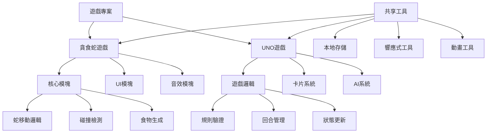

# 遊戲專案改進計劃

## 專案概覽
您的專案包含兩個遊戲：
1. **霓虹貪食蛇** (`snake.html`) - 現代化設計的貪食蛇遊戲，具有響應式設計、虛擬控制器和音效
2. **UNO 遊戲 - 增強版** (`uno.html`) - 功能完整的UNO卡牌遊戲，支持多張牌選擇和狀態顯示

## 貪食蛇遊戲分析

### 當前優點
- 現代化霓虹風格UI設計
- 響應式設計，支援桌面和移動設備
- 虛擬控制器（移動設備）
- 音效系統（使用Web Audio API）
- 本地存儲最高分
- 遊戲速度隨分數增加而提高

### 改進建議

#### 1. 性能優化
- **問題**: 使用 `setInterval` 進行遊戲循環，可能導致性能問題
- **建議**: 改用 `requestAnimationFrame` 以獲得更好的性能和流暢度
- **預期效果**: 更流暢的動畫，減少CPU使用率

#### 2. 遊戲功能增強
- **添加障礙物系統**: 隨機生成的障礙物增加遊戲難度
- **特殊食物類型**: 不同顏色的食物提供不同效果（加速、減速、加分等）
- **關卡系統**: 每達到一定分數進入新關卡，增加難度

#### 3. 用戶體驗改進
- **添加觸摸滑動手勢**: 除了虛擬按鈕外，支援滑動手勢控制
- **遊戲統計**: 顯示遊戲時間、移動次數、食物吃取效率等
- **視覺效果增強**: 蛇身漸變色、食物動畫效果

#### 4. 代碼結構優化
- **分離CSS/JS**: 將CSS和JavaScript代碼分離到獨立文件
- **模塊化重構**: 將遊戲邏輯分解為獨立模塊（Game, Snake, Food, UI等）

## UNO遊戲分析

### 當前優點
- 完整的UNO遊戲規則實現
- 多張牌選擇功能（符合PRD要求）
- 狀態顯示優化（顏色指示器、數值顯示）
- 電腦AI對手
- 響應式設計

### 改進建議

#### 1. 遊戲規則完善
- **UNO懲罰規則**: 忘記喊UNO時抽牌懲罰
- **挑戰規則**: 對+4牌的挑戰機制
- **計分系統**: 完整計分系統，而非簡單的勝負判定

#### 2. 多人遊戲支持
- **添加更多玩家**: 支援2-4名玩家（可選真人或AI）
- **在線對戰**: 基礎的WebSocket多人對戰功能
- **AI難度選擇**: 簡單、中等、困難AI級別

#### 3. 用戶界面改進
- **動畫效果**: 卡片飛行動畫、翻轉動畫
- **音效系統**: 添加卡片音效、背景音樂
- **主題切換**: 不同顏色主題選擇

#### 4. 性能優化
- **DOM操作優化**: 減少不必要的DOM重繪
- **事件委託**: 使用事件委託減少事件監聽器數量
- **記憶體管理**: 及時清理不再使用的遊戲狀態

## 跨遊戲改進建議

### 1. 專案結構優化
```
venus/
├── snake/
│   ├── index.html
│   ├── style.css
│   ├── game.js
│   └── assets/
├── uno/
│   ├── index.html
│   ├── style.css
│   ├── game.js
│   └── assets/
├── shared/
│   ├── utils.js
│   └── components/
└── plans/
    └── game_improvement_plan.md
```

### 2. 現代化技術棧
- **使用ES6+模塊**: 提高代碼可維護性
- **添加構建工具**: 如Vite或Parcel用於開發
- **版本控制**: 使用Git進行版本管理

### 3. 可訪問性改進
- **ARIA標籤**: 為視障用戶添加適當的ARIA屬性
- **鍵盤導航**: 確保所有功能可通過鍵盤操作
- **顏色對比度**: 確保足夠的顏色對比度

### 4. 測試與文檔
- **單元測試**: 為核心遊戲邏輯添加測試
- **文檔**: 添加代碼註釋和遊戲規則文檔
- **錯誤處理**: 添加錯誤邊界和用戶友好的錯誤消息

## 實施優先級

### 高優先級（立即實施）
1. 貪食蛇遊戲改用 `requestAnimationFrame`
2. UNO遊戲添加UNO懲罰規則
3. 兩個遊戲添加基本的錯誤處理
4. 分離CSS/JS到獨立文件

### 中優先級（短期目標）
1. 貪食蛇遊戲添加觸摸滑動手勢
2. UNO遊戲添加AI難度選擇
3. 兩個遊戲添加音效系統
4. 優化移動設備體驗

### 低優先級（長期目標）
1. 貪食蛇遊戲添加關卡系統
2. UNO遊戲添加多人對戰功能
3. 添加遊戲統計和分析
4. 創建遊戲選擇菜單頁面

## 技術架構圖



## 預期成果

實施這些改進後，您的遊戲專案將：

1. **性能提升**: 更流暢的遊戲體驗，減少資源消耗
2. **功能豐富**: 更多遊戲模式和功能
3. **用戶體驗改善**: 更直觀的界面和更好的可訪問性
4. **代碼質量提高**: 更易維護和擴展的代碼結構
5. **跨平台兼容**: 更好的移動設備支持

## 下一步行動

1. **審查此計劃**: 確認優先級和可行性
2. **創建詳細任務列表**: 將每個建議分解為具體的編碼任務
3. **開始實施**: 從高優先級任務開始
4. **測試與反饋**: 每個階段進行測試並收集用戶反饋

您對這個改進計劃有什麼想法？是否需要調整任何部分的優先級或範圍？